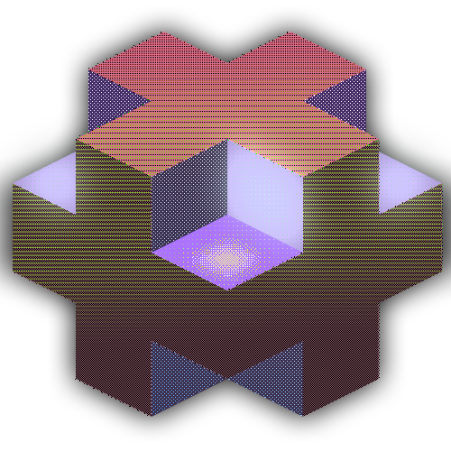

|  | Creating graphics and scalable   web applications using  React/Node.js/Express/TailwindCSS #OpenForWork #JavaScript |
| --- | --- |

|  *  *  *  | [***Claim Badge***  hypercube <small>via holopin</small> ](holopin.io/collect/clfcyjs6024540fjuc2sqb27w "Claim Hypercube Interconnection Network")
| --- | --- |

