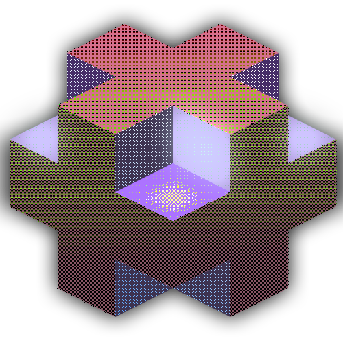

  <samp>
    
  </samp>

<h1 align="center">Matthieu Felker</h1>

  Full Stack Developer · ERP & BI Specialist · Building Materials Industry

  <a href="https://matthieufelker.com">Portfolio</a> ·
  <a href="mailto:matt@matthieufelker.com">Email</a> ·
  <a href="https://linkedin.com/in/matthieufelker">LinkedIn</a>

---

I build tooling at the intersection of warehouse operations, ERP systems, and business intelligence — primarily for the lumber and building materials industry.

My day-to-day spans Bistrack/Epicor ERP, Oracle WMS, Phocas BI, and custom browser automation. When the software doesn't do what the business needs, I close the gap.

**Currently working on:**
- Tampermonkey userscripts that extend Oracle WMS Pulse boards with real-time KPI dashboards, productivity tracking, and variance analytics
- Custom SQL reporting against Bistrack's schema for procurement, inventory turns, and min/max replenishment
- BI dashboards in Phocas covering ABC analysis, declining sales detection, and inventory aging

**Other interests:**
- SaaS tooling for the LBM industry
- Web3 / Hedera development
- Commodity lumber pricing tools and market dashboards

---

  

  
  
  
  
  
  
  

